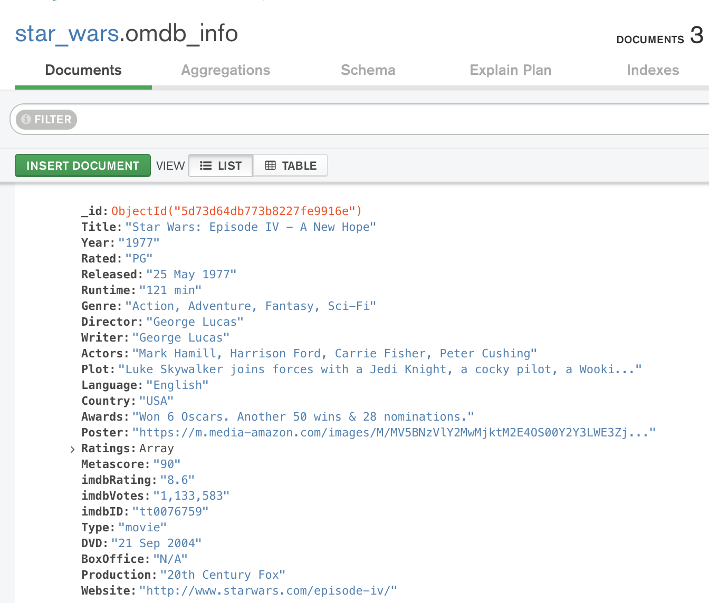
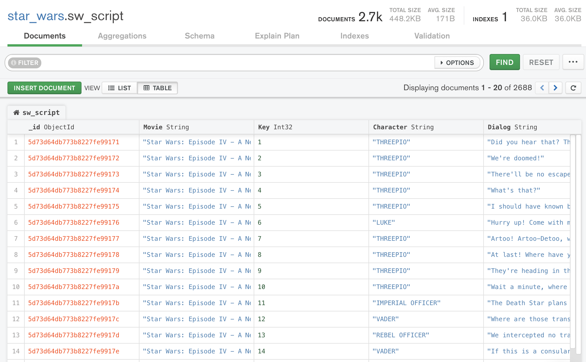

# Star Wars Script

### Project Proposal

  In this assignment, we were tasked to perform ETL (*E*xtract, *T*ransform, and *L*oad) by combining two or more data sources and migrating them into a relational or non-relational database. We chose to use the non-relational (NoSQL) database program, MongoDB, as the datasets, while very informative, lacked cohesion. 
  
---  

### Data Cleanup and Analysis

**EXTRACT** (Sources)

+ https://www.kaggle.com/xvivancos/star-wars-movie-scripts

 From this source we retrieved .txt files of the scripts from the first three Stars Wars films (i.e. Episode IV, Episode V, and Episode VI).

+ http://www.omdbapi.com/

  From this source we retrieved JSON-formatted data of the first three Star Wars films.
  
**TRANSFORM**

OMDB Data:
  In Jupyter Notebook, we retrieved the movies ids from the OMDB API site, then made a loop that puts the data into a list of dictionaries for processing with MongoDB.
  
 Kaggle Data:
  for this data, we first converted the txt files into Panda dataframes, then manipulated the data by adding and reordering the columns. We finally combined the three seperate movie dataframes into one dataframe (to allow for easier processing) and made that dataframe into a dictionary to allow for updating into MongoDB.
  
  
**LOAD**

 We loaded the OMDB file and Kaggle script into MongoDB.
 
 Screenshot: List view of the OMDB file as viewed on MongoDB Compass.

Screenshot: Table view of the Kaggle script from MongoDB Compass.

